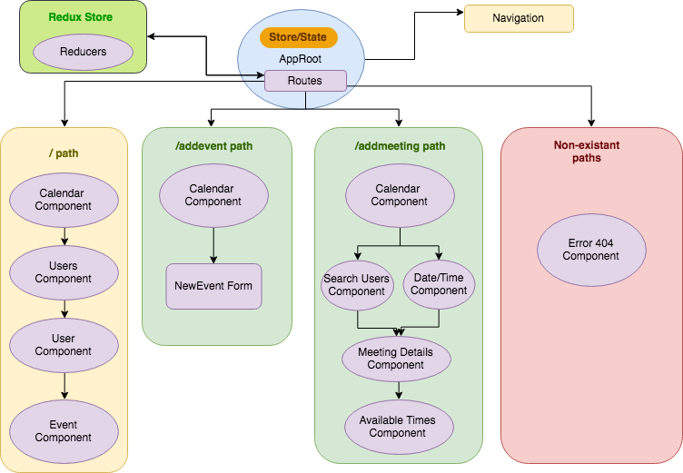

# Meeting Manager

#### Epicodus Capstone, 09/21/2018

#### By Devin Mounts

## A web application that allows users to view and schedule events in a calendar. Users can query the calendar to schedule a meeting of a chosen duration with required attendees. Program returns available dates/times for meetings, given individual scheduling concerns.

## Component Structure

## Specs

| Behavior | Input | Output |
|----------|-------|--------|
| Program displays calendar with users and scheduled events | N/A| Calendar |
| Program allows a user to schedule an event and add it to the calendar | User: Devin Mounts, Event: Lunch, Date: 09/21/2018, Time: 12:00pm-1:00pm, Duration: 1 hour, Attendees: Tipper | Event info is added to calendar |
| Program allows users to edit event information | User: Devin Mounts, Event: Dinner, Date: 09/21/2018, Time: 6:00pm-8:00pm, Duration: 2 hours, Attendees: Tipper  | Event & info is updated on Calendar |
| Program allows users to query calendar for available meeting times for multiple users | Duration: 1 hour, Required Attendees: Tipper, Devin | Available Dates/Times: 9/22/2018: 12:00pm-1:00pm; 9/22/2018: 3:30pm-4:30pm |
| Program allows user to select a returned meeting time, and add event to calendar | Select: 9/22/2018: 3:30pm-4:30pm|

## Setup on OSX

* Install Node.js
* Clone the repo
* Create a `.eslintrc.json` file with desired rules.
* Create a `.gitignore` file and include: `.DS_STORE, node_modules, build.`
* `npm install` to install dependencies
* `webpack-dev-server` to build and start the dev server
* `npm run lint` to explicitly run ESLint
* `npm run test` to run the unit tests with

## Contribution Requirements

1. Clone the repo
1. Make a new branch
1. Commit and push your changes
1. Create a PR

## Technologies Used

* JavaScript
* Node.js
* React
* Redux
* Babel
* Webpack
* ESLint
* Jest

## Links

* Repo: https://github.com/devinmounts/meeting-manager

## Notes

* Displaying dynamic data.
* Best practice for locating logic.

## License

This software is licensed under the MIT license.

Copyright (c) 2018 **Devin Mounts**
